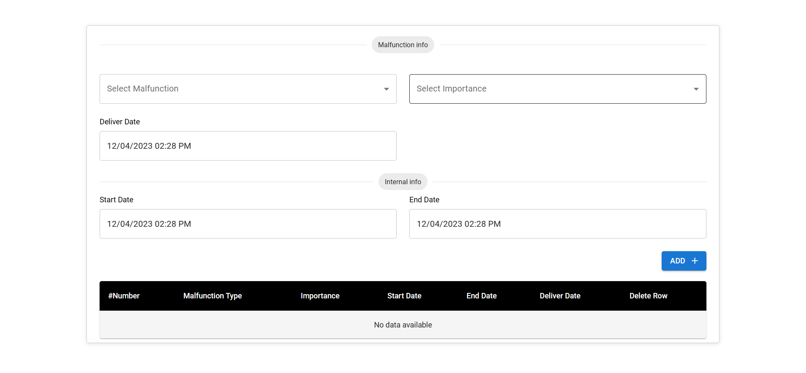
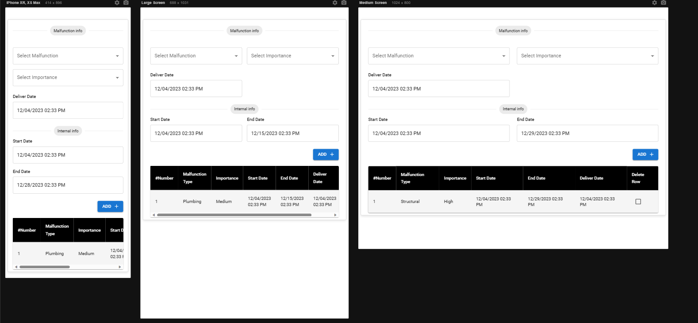

# Future of Egypt - Malfunction Task

## Description

The Malfunction Task application allows users to select a malfunction type, specify its importance, delivery date, start date, and end date. All fields must be selected, and the end date must be after the start date. Additionally, if the selected start and end dates already exist in the table, a notification Toastify will be displayed. The application is responsive and includes a table that have all requests with checkboxes to delete specific rows.

### Features

- Select malfunction type and importance.
- Specify delivery, start, and end dates.
- Validation to ensure the end date is after the start date.
- Inform Toast notifications for every field.
- Responsive design for various screen sizes.
- Table with checkboxes to delete specific row.

## Libraries Used

- **react**
- **MaterialUI-MUI**
- **Toastify**
- **dayjs**
## Live Demo

Explore the live version of the Malfunction Task Web App:

[Live Demo](https://futureofegypt-malfuctiontask.netlify.app/)

---
## Project Designs

Home Page 

Validate End Date 

Validate Existing Date 

Responive

## Usage

To get started with the Exercise Exploration Web App:

1. Clone this repository.
2. Navigate to the project directory.
3. Install dependencies using `npm install` or `yarn install`.
4. Run the application using `npm start` or `yarn start`.

## Contributions

Contributions are welcome! Feel free to submit issues, feature requests, or pull requests to help improve this project.
